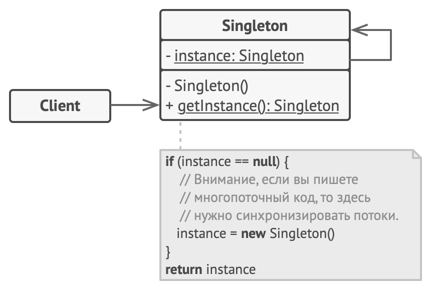

# Паттерны проектирования

### Порождающие:
1. [Абстрактная фабрика](#Абстрактная-фабрика)
2. [Строитель](#Строитель)
3. [Фабричный метод](#Фабричный-метод)
4. [Прототип](#Прототип)
5. [Одиночка](#Одиночка)

## Абстрактная фабрика

#### Назначение
Предоставляет интерфейс для создания семейств взаимосвязанных или 
взаимозависимых объектов, не специфицируя их конкретных классов.

#### Причины использования
- Система не должна зависеть от того, как создаются, компонуются и представляются 
входящие в нее объекты.
- Входящие в семейство взаимосвязанные объекты должны использоваться вместе и
вам необходимо обеспечить выполнение этого ограничения.
- Система должна конфигурироваться одним из семейств составляющих ее объектов.
- Вы хотите предоставить библиотеку объектов, раскрывая только их интерфейсы, 
но не реализацию.

#### Структура

#### Преимущества
- Изолирует конкретные классы.
- Упрощает замену семейства продуктов.
- Гарантирует сочетаемость продуктов.

#### Недостатки
- Сложно добавить поддержку нового вида продуктов.

#### [Пример](./abstract_factory)

## Строитель

### Назначение
Отделяет конструирование сложного объекта от его представления, так что в результате
одного и того же процесса конструирования могут получаться разные представления.

#### Причины использования
- Когда ваш код должен создавать разные представления какого-то объекта.
- Алгоритм создания сложного объекта не должен зависеть от того,
из каких частей состоит объект и как они стыкуются между собой.
- Избавление от конструктора со многими опциональными параметрами.

#### Структура

#### Преимущества
- Позволяет использовать один и тот же код для создания различных продуктов.
- Изолирует код сборки продукта от его основной бизнес-логики.
- Для добавления нового представления достаточно всего лишь определить новый вид строителя.
- Пошаговое создание продукта позволяет обеспечить контроль над процессом конструирования.

#### [Пример](./builder)

## Фабричный метод

#### Назначение
Определяет общий интерфейс для создания объекта,
но оставляет подклассам решение о том, какой класс реализовывать. 

#### Причины использования
- Классу заранее неизвестно, объекты каких классов ему нужно создавать.
- Когда вы хотите дать возможность пользователям расширять части вашего фреймворка или библиотеки. 

#### Структура

#### Преимущества
- Избавляет класс от привязки к конкретным классам продуктов.
- Выделяет код производства продуктов в одно место, упрощая поддержку кода.
- Упрощает добавление новых продуктов в программу.
- Реализует принцип открытости/закрытости.

#### Недостатки
- Может привести к созданию больших параллельных иерархий классов, 
так как для каждого класса продукта надо создать свой подкласс создателя.

#### [Пример](./factory_method)

## Прототип

#### Назначение
Позволяет копировать объекты, не вдаваясь в подробности их реализации. 

#### Причины использования
- Код не должен зависеть от классов копируемых объектов.
- Экземпляры класса могут находиться в одном из не очень большого числа
 различных состояний. Может оказаться удобнее использовать набор прототипов и клонировать их, 
 а не реализовывать каждый раз класс вручную в подходящем состоянии. 

#### Структура

#### Преимущества
- Позволяет клонировать объекты, не привязываясь к их конкретным классам.
- Меньше повторяющегося кода инициализации объектов.
- Ускоряет создание объектов.
- Альтернатива созданию подклассов для конструирования сложных объектов.

#### Недостатки
- Сложно клонировать составные объекты, имеющие ссылки на другие объекты.

#### [Пример](./prototype)

## Одиночка

#### Назначение
Гарантирует, что у класса есть только один экземпляр, и предоставляет к нему глобальную точку доступа.

#### Причины использования
- Должен быть ровно один экземпляр некоторого класса, легко доступный всем клиентам.
- Единственный экземпляр должен расширяться путем порождения подклассов, 
и клиентам нужно иметь возможность работать с расширенным экземпляром без модификации своего кода. 

#### Структура

#### Преимущества
- Гарантирует наличие единственного экземпляра класса.
- От класса Singleton можно порождать подклассы, а приложение легко сконфигурировать экземпляром расширенного класса.
- Реализует отложенную инициализацию объекта-одиночки.

#### Недостатки
- Проблемы мультипоточности.
- Требует постоянного создания Mock-объектов при юнит-тестировании.

#### [Пример](./singleton)