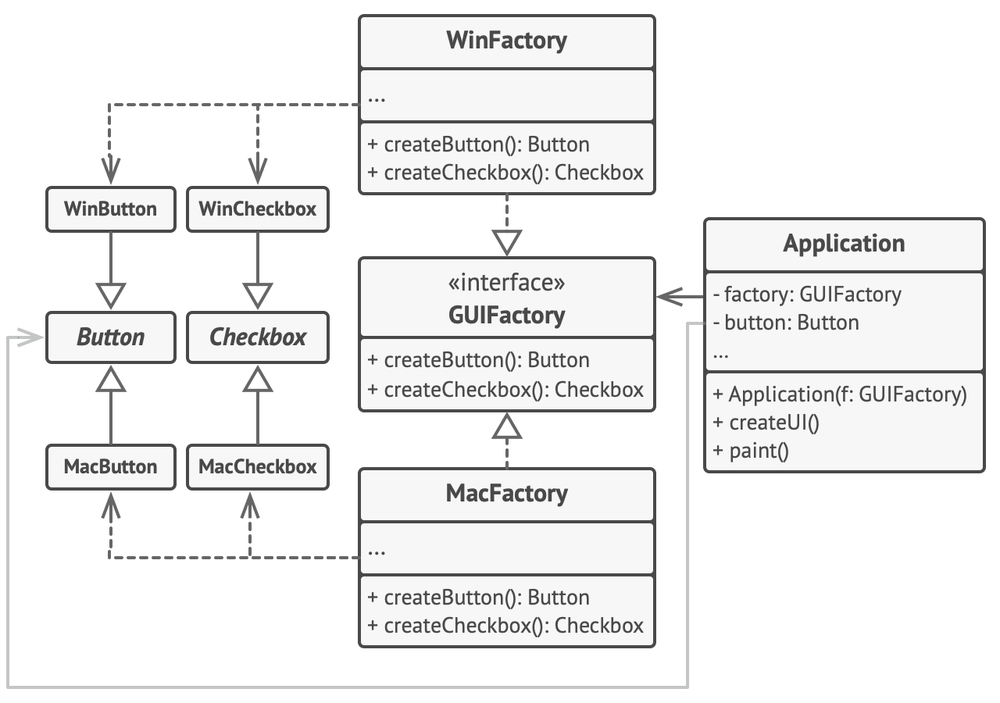

# Паттерны проектирования

### Порождающие:
1. [Абстрактная фабрика](#Абстрактная-фабрика)
2. [Строитель](#Строитель)
3. [Фабричный метод](#Фабричный-метод)

## Абстрактная фабрика

#### Назначение
Предоставляет интерфейс для создания семейств взаимосвязанных или 
взаимозависимых объектов, не специфицируя их конкретных классов.

#### Причины использования
- Система не должна зависеть от того, как создаются, компонуются и представляются 
входящие в нее объекты.
- Входящие в семейство взаимосвязанные объекты должны использоваться вместе и
вам необходимо обеспечить выполнение этого ограничения.
- Система должна конфигурироваться одним из семейств составляющих ее объектов.
- Вы хотите предоставить библиотеку объектов, раскрывая только их интерфейсы, 
но не реализацию.

#### Структура

#### Преимущества
- Изолирует конкретные классы.
- Упрощает замену семейства продуктов.
- Гарантирует сочетаемость продуктов.

#### Недостатки
- Сложно добавить поддержку нового вида продуктов.

#### [Пример](./abstract_factory)

## Строитель

### Назначение
Отделяет конструирование сложного объекта от его представления, так что в результате
одного и того же процесса конструирования могут получаться разные представления.

#### Причины использования
- Когда ваш код должен создавать разные представления какого-то объекта.
- Алгоритм создания сложного объекта не должен зависеть от того,
из каких частей состоит объект и как они стыкуются между собой.
- Избавление от конструктора со многими опциональными параметрами.

#### Структура

#### Преимущества
- Позволяет использовать один и тот же код для создания различных продуктов.
- Изолирует код сборки продукта от его основной бизнес-логики.
- Для добавления нового представления достаточно всего лишь определить новый вид строителя.
- Пошаговое создание продукта позволяет обеспечить контроль над процессом конструирования.

#### [Пример](./builder)

## Фабричный метод

#### Назначение
Определяет общий интерфейс для создания объекта,
но оставляет подклассам решение о том, какой класс инстанциировать. 

#### Причины использования
- Классу заранее неизвестно, объекты каких классов ему нужно создавать.
- Когда вы хотите дать возможность пользователям расширять части вашего фреймворка или библиотеки. 

#### Структура

#### Преимущества
- Избавляет класс от привязки к конкретным классам продуктов.
- Выделяет код производства продуктов в одно место, упрощая поддержку кода.
- Упрощает добавление новых продуктов в программу.
- Реализует принцип открытости/закрытости.

#### Недостатки
- Может привести к созданию больших параллельных иерархий классов, 
так как для каждого класса продукта надо создать свой подкласс создателя.

#### [Пример](./factory_method)
