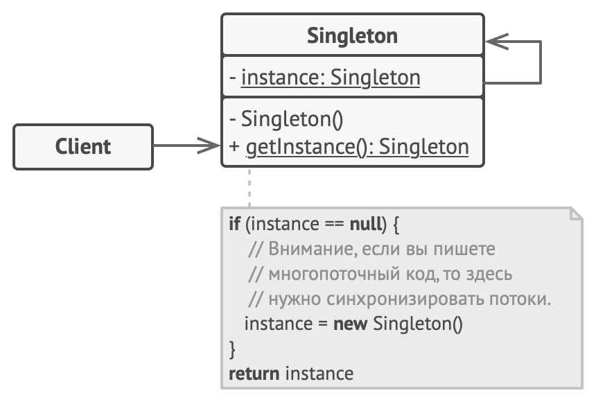

## Одиночка

#### Назначение
Гарантирует, что у класса есть только один экземпляр, и предоставляет к нему глобальную точку доступа.

#### Причины использования
- Должен быть ровно один экземпляр некоторого класса, легко доступный всем клиентам.
- Единственный экземпляр должен расширяться путем порождения подклассов, 
и клиентам нужно иметь возможность работать с расширенным экземпляром без модификации своего кода. 

#### Структура

#### Преимущества
- Гарантирует наличие единственного экземпляра класса.
- От класса Singleton можно порождать подклассы, а приложение легко сконфигурировать экземпляром расширенного класса.
- Реализует отложенную инициализацию объекта-одиночки.

#### Недостатки
- Проблемы мультипоточности.
- Требует постоянного создания Mock-объектов при юнит-тестировании.